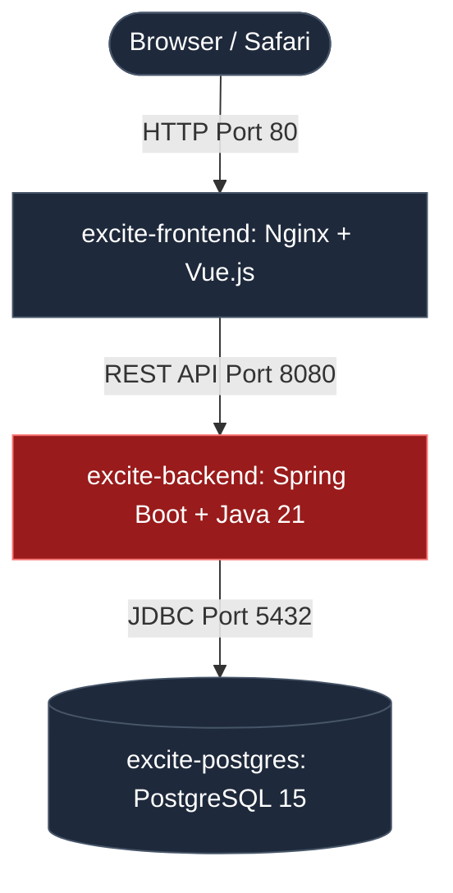

# Team Leave Calendar & On-Call Rotation System

An elegant, production-ready full-stack application engineered for the **Team Excite** hiring process. The system orchestrates team leave management and weekly on-call schedule rotations, featuring real-time automated conflict detection.

---

## Preview & Architecture Overview

The system features a bespoke, high-contrast digital dark-mode theme inspired by the **Excite Hungary** corporate identity, incorporating automated visual cues for conflicting operational schedules.



---

## Key Features

*   **Bespoke Excite Identity UI**: Styled with a responsive, fluid layout tailored for both desktop environments and mobile-view constraints.
*   **Reactive Client-Side Filtering**: Instant, memory-cached schedule sorting by individual team members without redundant API roundtrips.
*   **Automated Conflict Evaluation**: Real-time conditional alerting system indicating schedule overlaps when an on-call rotation period collides with an approved or pending staff leave.
*   **Fully Sanitized Architecture**: Zero hardcoded credentials or fallback variables in the source code; configuration is injected dynamically via environmental runtimes.
*   **One-Command Local/Prod Parity**: Zero localized setup friction through unified multi-stage container isolation.

---

## Tech Stack & Prerequisites

*   **Frontend**: Vue 3 (Composition API, `script setup`), Vite, Tailwind CSS, Axios.
*   **Backend**: Java 21, Spring Boot, Gradle, Spring Data JPA, Hibernate.
*   **Database**: PostgreSQL 15.
*   **Deployment**: Docker, Docker Compose, AWS EC2, Nginx, DuckDNS.

### Prerequisites
The **only** software dependency required on the host operating system is **Docker Desktop** (incorporating Docker Compose). Local runtimes for Java, Gradle, or Node.js are strictly bypassed.

---

## 🐳 Quick Start (Local Deployment)

To execute the entire ecosystem within a synchronized local container mesh, navigate to the repository root and issue the following command:

```bash
docker-compose up -d --build
```

### Accessing the Applications
Once the multi-stage build finishes and containers enter the `Up` state, access the platform endpoints via your browser:

*   **Frontend User Interface**: [http://localhost](http://localhost) *(Standard HTTP Port 80)*
*   **Backend REST API Gateway**: [http://localhost:8080/api/team-members](http://localhost:8080/api/team-members)
*   **Database Inspection**: Connection available on `localhost:5432` *(DB: `leave_management`, User: `excite_user`)*

### Housekeeping & Diagnostics
Should you encounter local database metadata conflicts from legacy iterations, purge the active volumes prior to initialization:

```bash
# Total stack teardown including volume states
docker-compose down -v

# Stream operational application logs actively
docker-compose logs -f
```

---

## Security & Environment Mapping

The application utilizes strict environment-driven dependency injection. Security tokens and persistence connectivity strings are managed seamlessly through `docker-compose.yml` into the Spring Boot `application.yaml` layout:

| Environment Variable | Production Context | Function |
| :--- | :--- | :--- |
| `SPRING_DATASOURCE_URL` | `jdbc:postgresql://postgres-db:5432/leave_management` | Secure database container reference |
| `SPRING_DATASOURCE_USERNAME` | `excite_user` | Dynamic db system role |
| `SPRING_DATASOURCE_PASSWORD` | `excite_secure_password` | Isolated connection string |
| `SPRING_JPA_HIBERNATE_DDL_AUTO`| `update` | Automated relational schema parsing |

---

## Project Repository Tree

```text
.
├── backend/
│   └── leave-calendar/
│       ├── src/                # Spring Boot enterprise Java modules
│       ├── build.gradle        # Multi-platform dependency manifest
│       └── Dockerfile          # Multi-stage Gradle build setup (JDK 21)
├── frontend/
│   ├── src/
│   │   ├── components/         # Atomic UI modules (Header, Cards, Table)
│   │   ├── composables/        # Isolated API state handlers (useLeaveManagement)
│   │   └── App.vue             # Orchestration view layer
│   ├── index.html
│   └── Dockerfile          # Nginx production proxy compiler
├── docker-compose.yml          # Container configuration matrix
└── README.md                   # Global execution blueprint
```

---

## Production AWS & DuckDNS Strategy

The solution is architected for zero-reconfiguration deployments on remote virtual public machines (AWS EC2 / Ubuntu instances):

1.  **Network Firewall Rule**: Map inbound communication slots for TCP ports `22` (SSH Access), `80` (Web UI traffic), and `8080` (API engine).
2.  **Continuous Synchronization**: Remote runtime pulling is handled exclusively via automated Git replication hooks directly inside target Ubuntu hosts.
3.  **Dynamic DDNS Routing**: Public instance IP adjustments are handled seamlessly via periodic 5-minute cron execution tasks mapped directly onto personal [DuckDNS](https://duckdns.org) registry blocks.
